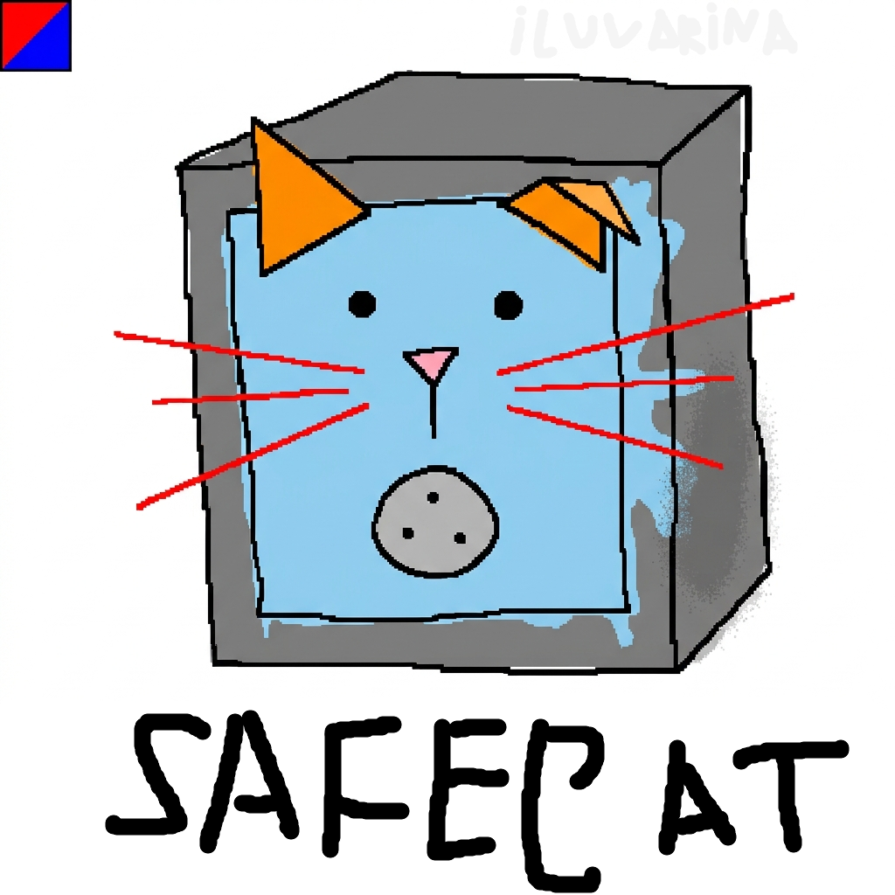

<div>
[](https://github.com/bejiihiu/safecat/actions)
[](LICENSE)
[](https://mcforge.net)
[](https://fabricmc.net)
[](https://neoforged.net)

<p align="right">
  <h1>SafeCat</h1>
  
</p>
</div>

Безопасные котики. SafeCat — a multi-loader economy library for Minecraft mods. Think Vault, but for Forge, Fabric, and NeoForge.

No reflection. Pure mediator. Thread-safe. Async by design.

## Features

- **Multi-loader** — Forge, Fabric, and NeoForge in one codebase. One API to rule them all.
- **Multi-currency** — not locked to a single currency type. Providers register any number of currencies.
- **Permission API** — `PermissionProvider` interface for cross-mod permission checks.
- **Chat API** — `ChatProvider` for formatted chat messages, with `ChatFormatEvent` for interception.
- **Event-driven** — typed events for registration, balance changes, permission checks, chat formatting, and command registration. No reflection or `instanceof` discovery.
- **Thread-safe** — all mutating methods return `CompletableFuture<>`. Core data structures are safe for concurrent access.
- **Java 21 records** — API surfaces use records for immutability and clarity (`Currency`, `TransactionResult`, `Event`, `EventReason`).
- **ServiceLoader discovery** — providers auto-register via `java.util.ServiceLoader`. No manual wiring.
- **JSON config** — all configuration is in `safecat.json` (not `.properties`). Clean, typed, easy to edit.
- **Pure Java `api/` module** — zero Minecraft or loader dependencies. Can be used outside the game.

## Quick Start

**For mod developers:** Add SafeCat as a dependency and implement `CurrencyProvider` from the `api` module. Register via `META-INF/services/kz.bejiihiu.safecat.api.CurrencyProvider` or subscribe to `RegisterCurrenciesEvent` on the platform event bus.

**For server owners:** Drop the SafeCat jar (matching your loader) into `mods/`. Economy providers auto-discover. Run `/safecat status` to verify the installation.

**Config:** Edit `config/safecat.json` after first run. Defaults are sane.

## Modules

| Module      | Description                                                              |
|-------------|--------------------------------------------------------------------------|
| `api`       | Pure Java interfaces. No Minecraft/loader dependencies.                  |
| `common`    | SafeCat Core. Implements API, ServiceLoader provider loading, mediator.  |
| `forge`     | Forge adapter. Forge events ↔ SafeCat API.                               |
| `fabric`    | Fabric adapter. Fabric API ↔ SafeCat API.                                |
| `neoforge`  | NeoForge adapter. NeoForge events ↔ SafeCat API.                         |
| `provider-numismatic`  | Reference economy provider implementation (Numismatic-based).   |
| `extension-luckperms`  | LuckPerms integration — real LP API, drop-in extension.        |

## Extensions

Extensions are JARs dropped into `config/safecat/extensions/`.  
Each checks for its target mod at runtime and registers providers automatically.

| Extension             | Target Mod  | Interface             | Status |
|-----------------------|-------------|-----------------------|--------|
| `extension-luckperms` | LuckPerms   | `PermissionProvider`  | ✅ Working |

Build:
```bash
./gradlew :extension-luckperms:build
```

See [Integrations](docs/dev/integrations.md) for details.

## Building

```shell
./gradlew build
```

Requires Java 21+. The build produces loader-specific jars under each loader module's `build/libs/`.

## Docs

- [Admin guide](docs/admin/) — setup, config, permissions, troubleshooting
- [Dev docs](docs/dev/) — architecture, provider API, events, migration, adapter guide

## AI-Generated Contributions

We use LLMs (Large Language Models) to write code, refactor, document, and even craft commit messages. AI is a tool — like a linter, a type checker, or a code generator. We don't care *how* the code was written, we care that it's **correct, maintainable, and idiomatic**.

### Guidelines for AI-assisted PRs

- **Quality over origin.** A PR written by an LLM is judged the same as a hand-written one: correct semantics, clean API, no regressions, tests green.
- **English not required.** If you're more comfortable describing the problem in another language — go ahead. We'll figure it out.
- **Refactoring is welcome.** AI is great at mechanical refactoring. Spot boilerplate? Suggest a PR.
- **Docs count.** Documentation PRs — typos, outdated sections, missing examples — are appreciated.
- **Don't write garbage.** We can tell when an LLM hallucinated an API that doesn't exist. If you're unsure, run the build and tests before opening the PR.

In short: we don't ban AI tools, we ban sloppy work. If the code compiles, the tests pass, and the design makes sense — it doesn't matter if it was written by a human, an LLM, or a well-trained parrot.

## License

SafeCat is licensed under the **GNU Affero General Public License v3** (or later). See [`LICENSE`](LICENSE) for the full text.
